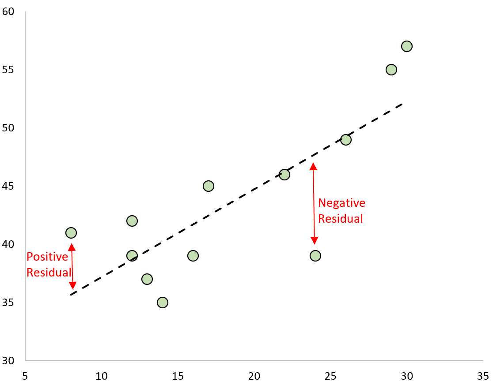
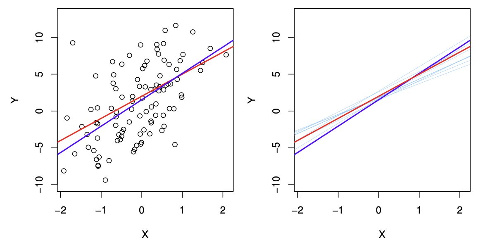

## Announcements

-   No HW this Sunday!

## Motivating example

A random sample of 50 students' gift aid for students at Elmhurst College in 2011.

```{r, echo=TRUE, message=FALSE}
library(tidyverse)
library(openintro)
data("elmhurst")
glimpse(elmhurst)
```

**Research Question**: What is the relationship between family income and price the student pays (total tuition - gift aid)?

## Scatter plot of family income and price paid

```{r}
ggplot(elmhurst, aes(x=family_income, y=price_paid))+
  geom_point() +
  theme_bw() +
  theme(axis.text.x = element_text(size=20),
        axis.title.x = element_text(size=25),
        axis.text.y = element_text(size=20),
        axis.title.y = element_text(size=25)) +
  labs(x="Family income ($1000s)", y="Price paid ($1000s)")
```

## We want a "line of best fit" to characterize the relationship between the two (continuous) variables

```{r}
ggplot(elmhurst, aes(x=family_income, y=price_paid))+
  geom_point() +
  theme_bw() +
  theme(axis.text.x = element_text(size=20),
        axis.title.x = element_text(size=25),
        axis.text.y = element_text(size=20),
        axis.title.y = element_text(size=25)) +
  labs(x="Family income ($1000s)", y="Price paid ($1000s)")+
  geom_smooth(method="lm", se=F)
```

## Simple linear regression model

We define the simple linear regression model as:

$$
Y = \beta_0 + \beta_1X + \epsilon, \epsilon \sim N(0,\sigma^2)
$$

We can also write this as:

$$
Y \sim N(\beta_0 + \beta_1X, \sigma^2)
$$

. . .

**Exercise**

Label each component of the model with one of the following terms: random variable, fixed variable, parameter

## Obtaining the estimates

We use **least squares estimation** determine the "best" estimated values of $\beta_0$ and $\beta_1$

::::: columns
::: {.column width="50%"}

:::

::: {.column width="50%"}
 

We will minimize the sum of squared residuals:

$\sum_i (y_i - (\beta_0+\beta_1x_i))^2$
:::
:::::

## Estimated regression line

We write the estimated regression line as:

$$
\hat{Y}=\hat{\beta_0}+\hat{\beta_1}X
$$

and write the residuals $r$ ($\hat{e}$) as $r=Y-\hat{Y}$

## Exercise

Use the output below to write the estimated regression line for the elmhurst data

```{r, echo=TRUE}
elmhurst_slr <- lm(price_paid ~ family_income, data=elmhurst)
summary(elmhurst_slr)$coefficients
```

## Standard error of the estimates



## Hypothesis testing for coefficient estimates

$$H_0: \beta_1 = $$

 

$$
\frac{\hat{\beta_1}}{SE(\hat{\beta_1})} \sim t_{n-2}
$$

## Confidence Interval

Similarly, we can use the t-distribution to calculate the confidence interval, or a plausible range for the true value of the population parameter $\beta_1$

$$
\hat{\beta_1} \pm t^*_{n-2}[SE(\hat{\beta_1})]
$$

## Interpreting the results

```{r, echo=TRUE}
elmhurst_slr <- lm(price_paid ~ family_income, data=elmhurst)
summary(elmhurst_slr)$coefficients
confint(elmhurst_slr)
```

 

*For each additional* \$1000 of family income, price paid in \$1000s increases by 0.05, or \$50*, on average. The association between family income and price paid is statistically significant (p\<.001, 95% CI: \[0.03,0.07\])*

## Interpreting the p-value and confidence interval individually

-   *Assuming there is no association between family income and price paid, the probability of observing results as extreme as these is \<.001. Therefore, we have evidence that there is a relationship between family income and price paid.*

-   *If we repeated this experiment 100 times and constructed a confidence interval in the same way each time, we would expect 95 of the intervals to contain the true value of* $\beta_1$. *Therefore, we are 95% confident that the true value of* $\beta_1$ *is between 0.03 and 0.07.*

## Exercise

Fit a model to assess the relationship between family income and gift aid. Write the fitted model and interpret the results.

```{r, eval=FALSE, echo=FALSE}
elmhurst_slr_gift <- lm(gift_aid ~ family_income, data=elmhurst)
summary(elmhurst_slr_gift)$coefficients
confint(elmhurst_slr_gift)
```
